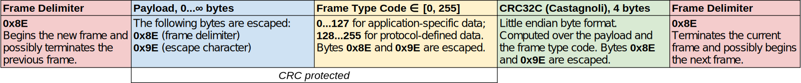

# PoPCoP

This is PoPCoP - a simple Point-to-Point Control Protocol.

The documentation is missing. Come back later.

## Languages

### C++

The C++17 implementation is designed for real-time resource-constrained embedded systems.
It needs one third-party dependency - the [Senoval](https://github.com/Zubax/senoval) header-only library.

### Python

The Python 3.5 implementation is dependency-free.
It can make use of PySerial, if available, to provide the optional serial port transport.

## Transport layer

Popcop is modeled after the [HDLC protocol](https://en.wikipedia.org/wiki/High-Level_Data_Link_Control).
Popcop offers a transparent data channel, arbitrary-length frames and a strong data integrity check.

Each frame is started and terminated with the byte 0x8E, referred to as *frame delimiter*.
A frame delimiter cannot appear anywhere within the frame.
If a frame delimiter is encountered anywhere inside the frame, it shall be escaped
by prepending the byte with an escape character 0x9E and then bitwise inverting the escaped byte.
If an escape character is encountered anywhere inside the frame, it is escaped as well in the same manner.

The values of the frame delimiter and escape character are chosen to be statistically optimal -
they are unlikely to be encountered in a regular uncompressed data stream of a typical embedded application,
and lie outside of the ASCII character set.
This feature makes Popcop efficient in applications where binary data and ASCII text data are exchanged over
the same interface.

